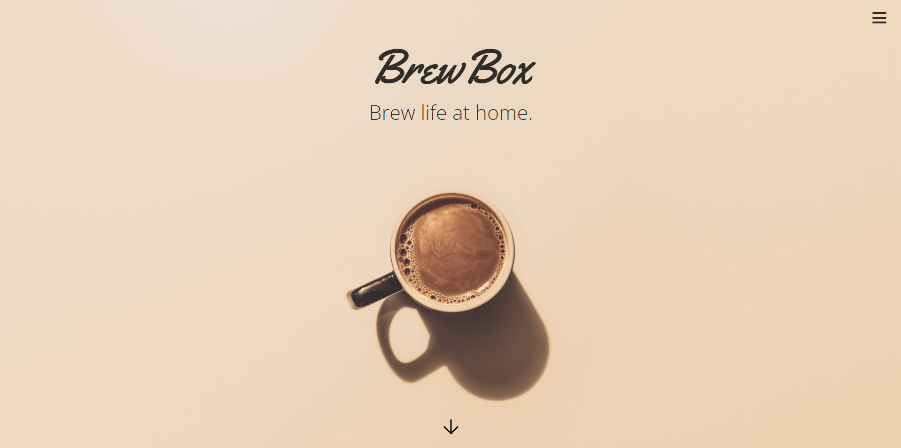

# BrewBox

## Description

***This project is under construction*** 

This application will be used for new coffee enthusiasts who want to explore the art of coffee. Users will be able to purchase a box of set items while being able to select a brew of their choice to complete their BrewBox. Returning or avid coffee drinkers can use the application to learn more about brews they might not know or purchase brews they like on their own.

This is a user-focused platform built using the MERN-stack single-page application architecture. It will utilize MongoDB as a back end, GraphQL API for data querying and manipulation, and an Express.js and Node.js server to handle server-side operations. The front end will be built using React and provide a seamless user interface for easy interaction.
The platform will implement user authentication with JSON Web Tokens (JWT), ensuring secure access to user accounts and preventing unauthorized access. With this feature, users can create accounts, and perform actions tailored to their specific permissions.

## Table of Contents

- [License](#license)
- [Updates](#updates)
- [Contributors](#contributors)
- [Questions](#questions)

## Updates

I have drafted a sample homepage through Figma which gave me perspective on the good and bad ideas when it came to my project. My goal is to keep the website to a minimalist concept with fluid transitions and feeling comfortable with open spaces. This has allowed me freedom to customize the use of space and explore ideas on the next few page ideas. So far this is strictly a static HTML draft so I can make sure my concepts are right where I want them to be. This will be translated into React once the initial drafts are complete.

Until then, enjoy a couple screenshots of the first built draft!

## License
 

© COPYRIGHT BREW BOX 2023 | UNBOX YOUR BREW

## Contributors
Created by: 
- <a href="https://github.com/Morralytics"> Nick Morris </a>    

## Questions
If you have any questions about the application, feel free to reach me by email.
